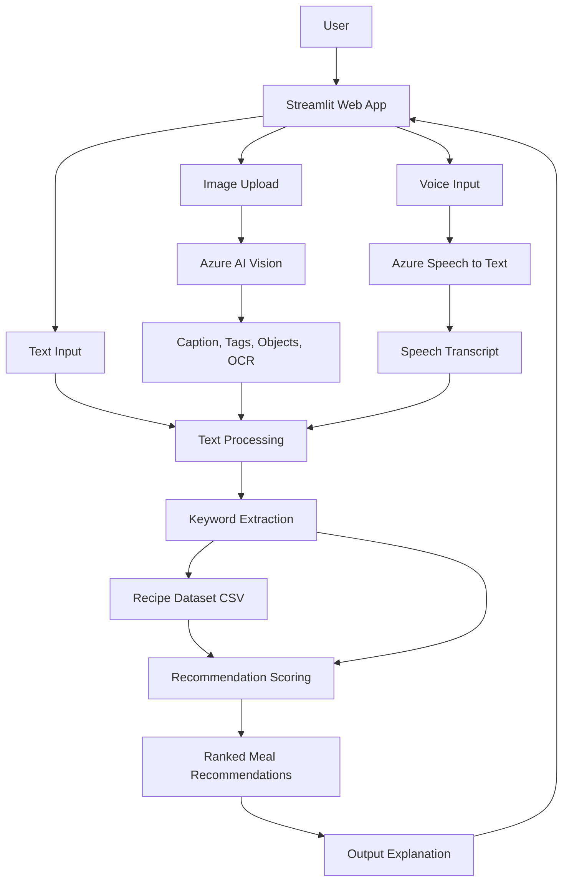

# Smart Meal Recommendation Bot

A multimodal recommendation bot built for **SIT788 Engineering AI Solutions - Task 11.2HD Option 2**.

The bot recommends meals from a local recipe dataset by combining three types of user input:

- **Text input**: typed food preference or dietary requirement
- **Image input**: uploaded ingredient or food image analysed using Azure AI Vision
- **Voice input**: spoken preference transcribed using Azure Speech to Text

The system combines the extracted information, matches it against a recipe dataset, scores each recipe, and returns the most relevant meal recommendations.

---

## Project Overview

This project demonstrates an intelligent cloud-based recommendation system. The bot is designed to help users choose suitable meals based on what they want, what ingredients they have, and what they say through voice input.

Example use case:

> A user types "I want something healthy and quick", uploads an image of chicken and rice, and records a voice note saying "high protein dinner".  
> The bot extracts keywords from all inputs and recommends the best matching recipes from the dataset.

---

## Key Features

- Text-based meal preference input
- Image upload and analysis using Azure AI Vision
- Voice input transcription using Azure Speech to Text
- Local recipe dataset stored as CSV
- Keyword-based recommendation scoring
- Ranked meal recommendations with matched terms
- Streamlit web interface
- Simple architecture suitable for academic demonstration and video walkthrough

---

## Technologies Used

| Component | Technology |
| --- | --- |
| Programming language | Python |
| Web interface | Streamlit |
| Image analysis | Azure AI Vision |
| Speech transcription | Azure Speech to Text |
| Dataset | Local CSV recipe dataset |
| Environment variables | python-dotenv |
| Data handling | pandas |

---

## Azure Services Used

### 1. Azure AI Vision

Azure AI Vision is used to process uploaded food or ingredient images. It extracts visual information such as:

- image caption
- tags
- detected objects
- OCR text, where available

This allows the bot to understand the visual content of an uploaded image and use it as part of the recommendation process.

### 2. Azure Speech to Text

Azure Speech to Text is used to convert a user's spoken food preference into text. The transcribed text is then combined with the typed input and image analysis results.

---

## Recommendation Logic

The recommendation engine follows these steps:

1. Collect user text input.
2. Analyse the uploaded image using Azure AI Vision.
3. Transcribe the recorded voice input using Azure Speech to Text.
4. Combine all extracted text into one search profile.
5. Clean and tokenize the combined text.
6. Compare the extracted keywords with each recipe's name, ingredients, cuisine, and tags.
7. Calculate a recommendation score for each recipe.
8. Return the top-ranked recipes with matched keywords and explanation.

The scoring is based on keyword overlap. Recipes that match more important user terms receive a higher score.

---

## System Architecture



---

## Project Structure

```text
smart-meal-recommendation-bot/
│
├── app.py
├── requirements.txt
├── .env.example
├── .gitignore
├── README.md
│
├── components/
│   ├── input_section.py
│   ├── results.py
│   └── sidebar.py
│
├── config/
│   └── settings.py
│
├── data/
│   └── recipes.csv
│
├── services/
│   ├── azure_speech.py
│   ├── azure_vision.py
│   ├── data_loader.py
│   ├── recommender.py
│   └── text_processing.py
│
└── docs/
    ├── architecture_flowchart_mermaid.md
    └── report_structure.md
```

---

## Setup Instructions

### 1. Clone the Repository

```bash
git clone https://github.com/AnthonyBnc/smart-meal-recommendation-bot.git
cd smart-meal-recommendation-bot
```

If you are creating the repository from scratch, create a folder first:

```bash
mkdir smart-meal-recommendation-bot
cd smart-meal-recommendation-bot
```

---

### 2. Create a Virtual Environment

For macOS or Linux:

```bash
python3 -m venv .venv
source .venv/bin/activate
```

For Windows:

```bash
python -m venv .venv
.venv\Scripts\activate
```

---

### 3. Install Dependencies

```bash
pip install -r requirements.txt
```

---

### 4. Create the Environment File

Copy the example environment file:

```bash
cp .env.example .env
```

For Windows PowerShell:

```bash
copy .env.example .env
```

Then open `.env` and add your Azure credentials:

```env
AZURE_VISION_ENDPOINT=https://your-vision-resource.cognitiveservices.azure.com/
AZURE_VISION_KEY=your_vision_key_here

AZURE_SPEECH_KEY=your_speech_key_here
AZURE_SPEECH_REGION=australiaeast
```

Important: Do not upload your real `.env` file to GitHub.

---

### 5. Run the Application

```bash
streamlit run app.py
```

The application will open in your browser.

---

## Dataset

The project uses a local CSV recipe dataset located at:

```text
data/recipes.csv
```

The dataset contains recipe information such as:

- recipe name
- cuisine type
- ingredients
- dietary tags
- preparation time
- meal category

This dataset is used by the recommendation engine to compare user preferences with available recipes.

---

## Example User Flow

1. The user types:

```text
I want a quick healthy dinner with chicken
```

2. The user uploads an image of available ingredients.

3. Azure AI Vision extracts image tags such as:

```text
food, chicken, rice, vegetable
```

4. The user records a voice preference such as:

```text
high protein meal
```

5. Azure Speech converts the audio into text.

6. The system combines all extracted keywords.

7. The recommendation engine ranks recipes.

8. The app displays the top recommended meals with scores and matched terms.

---

## How to Create a New GitHub Repository

### Step 1: Initialise Git

```bash
git init
```

### Step 2: Add a `.gitignore` File

Create a `.gitignore` file and add:

```text
.venv/
.env
__pycache__/
*.pyc
.DS_Store
.streamlit/secrets.toml
```

### Step 3: Add Files

```bash
git add .
git commit -m "Initial commit for smart meal recommendation bot"
```

### Step 4: Create a New Repository on GitHub

Create a new empty GitHub repository named:

```text
smart-meal-recommendation-bot
```

Do not initialise it with another README if you already have this local README.

### Step 5: Connect Local Project to GitHub

```bash
git branch -M main
git remote add origin https://github.com/YOUR_USERNAME/smart-meal-recommendation-bot.git
git push -u origin main
```

---

## Suggested Screenshots for Report

Include screenshots of:

1. Project folder in VS Code
2. Terminal running `streamlit run app.py`
3. Streamlit interface
4. Recipe dataset loaded in the app
5. Text input example
6. Image upload and Azure Vision output
7. Voice input and Azure Speech transcription
8. Final ranked recipe recommendations
9. Recommendation logic in the source code

---

## Video Demonstration Plan

The video demonstration should show:

1. Introduction to the bot purpose
2. Short explanation of the dataset
3. Text preference input
4. Image upload and Azure Vision result
5. Voice recording and transcription
6. Recommendation output
7. Explanation of why the top recipe was selected

Suggested script:

> This is my Smart Meal Recommendation Bot for SIT788 Task 11.2HD Option 2.  
> The bot uses multimodal input, including text, image, and voice.  
> The image is processed by Azure AI Vision, and the voice input is transcribed using Azure Speech to Text.  
> The extracted information is combined and matched against a local recipe dataset.  
> The final output is a ranked list of recommended meals with matched keywords and explanation.

---

## Limitations

- The recommendation logic is keyword-based rather than fully machine-learning based.
- The result depends on the quality of image analysis and speech transcription.
- The dataset is small and can be expanded for better recommendation coverage.
- The system currently focuses on meal recommendations only.

---

## Future Improvements

Possible future improvements include:

- Using Azure OpenAI for more natural conversational recommendations
- Expanding the recipe dataset
- Adding user profiles and saved preferences
- Improving ranking with machine learning
- Adding nutrition information and allergy filtering
- Deploying the app online using Azure App Service or Streamlit Community Cloud

---

## Academic Integrity Note

This project is developed for academic demonstration. Any external datasets, APIs, cloud services, code libraries, or concepts used in the final report should be properly referenced using Harvard referencing style.
